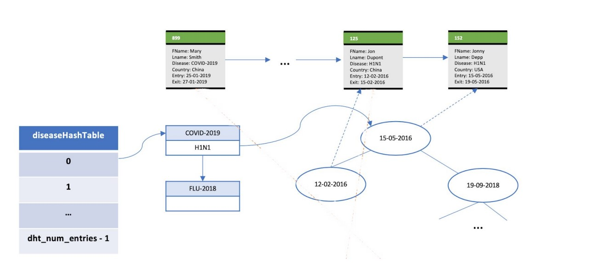
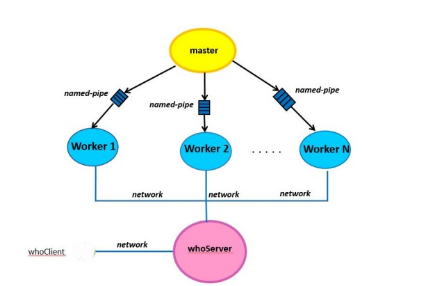

## Disease Aggregator

### [System Programming](http://cgi.di.uoa.gr/~mema/courses/k24/k24.html) - [Second Assigment](./resources/lib/hw3-spring-2020.pdf)

The aim of this project is to get familiarize with thread programming and network communication, get acquainted with creating proccesses making use of the fork/exec system calls, inter-process communication(IPC) via named pipes and signalsthe use of low-level I\O. 

As part of this work i implemented a distributed information processing software that that receives and asnwer queries about diseases infections. Specifically, three programms were  implemented: 
1) a master program that will create a series of Worker processes 
2) a multi-threaded server that will collect summary statistics from the Worker through netwok and queries from customers
3) a multithreaded client program whoClient that will create a lot threads, where each thread plays the role of a customer who will send questions to server.

## Implementation

#### Master

First of all the application starts numWorkers Workers child processes and distributes subdirectories with the countries evenly to all worker proccesses and inform each Worker via named pipe for  the subdirectories which he will be undertaken.

Each Worker process, for each catalog assigned to it, reads all its files in chronological order based on file names and fills a series of data structures( hashtables, linked lists, binary trees )that it will use for answer questions asked by the parent process. Upon finishing, each worker will send, via network, in the server proccess, summary statistics of the files he undertook.

The architectural design of data structures used for saving incoming data is depicted below

>

When this procedure finish, worker process receives [queries](./resources/lib/manual.txt) via socket from the server and send him the result back to him. 

Parent process finally waits to fork a new Worker process in case an existing Worker suddenly terminates.

#### Server

When the Server starts, the original thread should create numThreads threads. The main process thread is listening to ports queryPortNum and statisticsPortNum, accepts connections with the accept () system call and place the socket descriptors correspond to the connections in a circular size buffer defined by bufferSize. 

The job of server threads is to take a file descriptor form circular buffer, identify where the request came from(worker or client) and service that request. When the Server accepts a question from a client, it forwards it to the respective worker processes via socket and waits the answer from the workers. The question he promoted in a Worker process along with the answers that server receives from this Worker, are printed on stdout. Server also promotes the answer to corresponding thread of Client who asked the question

### Client

The multithreaded Client functions as follows. The main thread stars by reading the queryFile line by line. In each line there is an order for the server. For each command a new thread is being created that will undertake to send a command via socket to the server. Threads are created but not immediately connected to server. When all the threads of the thread pool have receive an order, then the threads should start all together to try to connect to the server and send their order.

When commands are sent, each thread will print the answer it received from Server to stdout and can terminate. When all the threads are finished, the client also finishes.


The overall architectural design of the Project is depicted below.

>

### Compilation and Running

Compile
```bash
make
```
Execution with personalized parameters
 ```bash
  ./master –w numWorkers -b bufferSize –s serverIP –p serverPort -i input_dir
 ```
where -w is the number of worker proccesess, -b is the buffer size for reading trough named-pipes, -s is the IP address of the server, -p is the port that the server is listening and -i is the path of the input directory

 ```bash
  ./whoServer –q queryPortNum -s statisticsPortNum –w numThreads –b bufferSize
 ```
where -q is the port to communicate with client, -s the port to communicate with master, -w the number of thread and -b the size of the circular buffer

 ```bash
  ./whoClient –q queryFile -w numThreads –sp servPort –sip servIP
 ```
where -q is the name of the file which contains the queries, -w is the number of client's threads, -sp is the port the server is listening for connections with the client and -sip is the server's IP address

### Scripts

The input directory can me mannually created by running the shell script files_create.sh executable(./resources/scripts/input_generator/create_file)

Execution
 ```bash
  ./create_files.sh diseaseFile countriesFile input_dir numFilesPerDirectory numRecordsPerFile
 ```
Also there is an option to generate random queries that can be sent to the servers by running the python script generator.py(./resources/scripts/query_generator/generator.py)

Execution
 ```bash
  python generator.py
 ```
